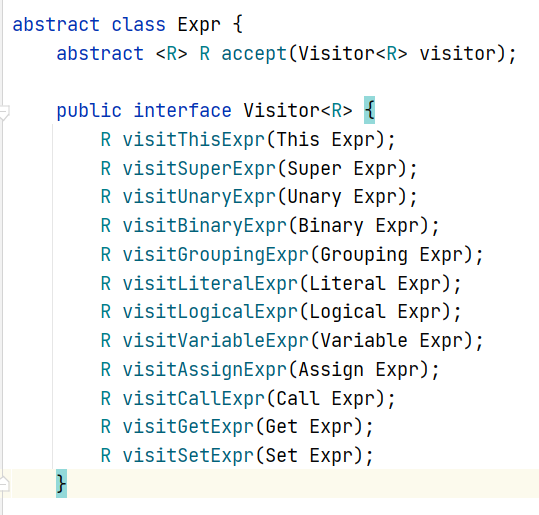
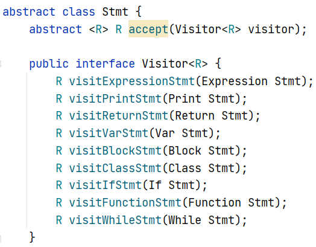
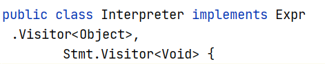

[toc]

# Summary

- 跟随[Crafting Interpreters](http://www.craftinginterpreters.com/contents.html)的脚步，完成了一个**语言Lox的Interpreter**的基础功能
- 这是一篇如何实现这些功能的简略总结，以便日后查看

## 词法分析

- `TokenType.java`中为一个包含所有Token的type的enum
- 在`Token.java`中定义`class Token`的结构
- 在`Scanner.java`中，便利一边程序字符串，输出Token流

## 语法分析

- 在`Parser.java`中，根据Token流，输出`class Stmt`构成的AST（语法分析树）

### 递归下降

- 采用**递归下降的方式**来分析Token：
  - 先分析整个Statement，再分析expression
  - 对于Statement和expression，先分析低优先级的，低优先级会包含高优先级（就像+运算中会包含*运算一样）
- 这样经过递归，就可以输出整个代码的AST

### 后缀表达式

- 在`VisitAst.java`内，将expression的AST按后序遍历的方式遍历，就可以得到一个后缀表达式

## 对象的运行时解释

- 由于是解释器，因此对于Lox对象的解释我们直接使用Java的`Object`类
- 即，每一个Lox对象都经过Java向下转型动态的存储在Java中

### 访问者模式

- 代码被分为两种类型：`Expr`和`Stmt`

- 我们采用访问者模式来分别分析各种`Expr,Stmt`

  

  

  

- 根据如上的代码，我们可以知道：

  - 每一种不同类型，我们可以调用`.accept()`来进行`Visiter<R>`中重载的`visitxxx()`来进行不同的处理
  - 这样，对于得到的AST，我们就可以在运行时进行动态的解释

## 作用域

- 为了实现作用域，我们定义`Enviroment.java`

### 环境链

- Enviroment应该是一个链表型的结构，每个Enviroment可以指向他的上层环境
- 每经过一个`{`就新建一个环境，在这个环境中声明的变量与这个环境绑定
- 每经过一个`}`就推出一个环境
- 查找变量时从本层开始往上层查找，查找到第一个符合的为止
- 这样就可以逐层查找变量

## 控制流

- 添加一些控制流关键字
- 值得注意的是，对于循环，将for翻译为while进行解释

## 函数

- 使用`fun`定义函数
- 由于函数具有函数体，而且为了之后在类中复制method，需要单独一个类`LoxFunction`
- 将函数看作一个变量
- 函数的返回看作是一个Error，使用Java的错误机制
  - 这样遇到返回，就回到调用函数之前的状态，并返回一个计算好的value

### 闭包

- 为了能够在局部函数中使用其外部的变量
- 对于每个函数都实现一个`closure`变量，存储其上层环境

## 语义分析

- 为什么要语义分析：
  - 若存在局部变量，那么需要一层一层向上找，如果在运行时，太慢了
  - 我们定义一个`Resolver.java`来先对局部变量的depth进行分析
- 理论上来说，我们可以将不需要运行时信息的一切操作都放在这个阶段
  - 由于Lox是动态类型，所以类型检测一般不放在语义分析

### 全局变量

- 为了支持全局变量，我们先在`Interpreter`内定义一个`Enviroment globals`
  - 我们可以在`Interpreter`中添加默认的global变量
  - **对于用户添加变量时，我们在语义分析中只分析到`globals`的下一层**
  - 这样如果在运行时，发现depth为0，就直接去`globals`中搜索，加快全局变量的速度

## 错误检测

- 通过Java的错误机制来进行错误检查
- 在词法，语法，语义阶段产生编译错误
- 在interpreter阶段，产生运行错误`RuntimeError`

## 类

- 以关键词`class`来定义类
- 由于Lox无法在类的定义时定义类的`fields`
- 我们实现两个class：`LoxClass`和`Loxinstance`
  - 来表示类和类的实例

### 构造函数

- 使用关键字`init`来声明构造函数

### 成员属性

- 对于`fields`，我们在定义时直接绑定到类的实例

### 成员函数

- Instance通过一个引用来向其母体来查找成员函数
- 当成员函数被调用时，为此函数创建一个环境，并在环境中添加this引用指向instance

### 继承

- 通过`<`来继承
- 对继承自己进行判断为错误
- 通过`super`关键字来进行调用父类的函数
- 为每个类的super都先产生一个环境，这样保证调用super都指向定义类的父类

